# Resume Intelligence Platform

> **RAG-powered resume analysis** — scores a resume against a job description using a full retrieval-augmented generation pipeline: parse → chunk → embed → vector search → LLM synthesis → evidence-grounded output. Built with Java 21 · Spring Boot 3 · PostgreSQL + pgvector · Ollama/OpenAI · React + TypeScript.

[](https://github.com/prince-ramteke/AI-Resume-Platform/actions/workflows/ci.yml)
[](https://openjdk.org/projects/jdk/21/)
[](https://spring.io/projects/spring-boot)
[](https://github.com/pgvector/pgvector)
[](https://react.dev)
[](LICENSE)

| | |
|---|---|
| **Live Demo** | [ai-resume-platform.pages.dev](https://ai-resume-platform.pages.dev) |
| **API Base** | [ai-resume-platform-backend-rmgn.onrender.com/api](https://ai-resume-platform-backend-rmgn.onrender.com/api) |
| **Swagger UI** | [ai-resume-platform-backend-rmgn.onrender.com/swagger-ui/index.html](https://ai-resume-platform-backend-rmgn.onrender.com/swagger-ui/index.html) |

---

## Table of Contents

1. [Product Overview](#1-product-overview)
2. [Key Features](#2-key-features)
3. [Screenshots](#3-screenshots)
4. [Architecture](#4-architecture)
5. [End-to-End System Flow](#5-end-to-end-system-flow)
6. [AI / RAG Pipeline](#6-ai--rag-pipeline)
7. [Authentication & Email Verification](#7-authentication--email-verification)
8. [Tech Stack](#8-tech-stack)
9. [Backend Architecture](#9-backend-architecture)
10. [Database Design](#10-database-design)
11. [API Reference](#11-api-reference)
12. [Project Structure](#12-project-structure)
13. [Local Development](#13-local-development)
14. [Environment Variables](#14-environment-variables)
15. [Testing](#15-testing)
16. [CI/CD & Deployment](#16-cicd--deployment)
17. [Security](#17-security)
18. [Engineering Decisions](#18-engineering-decisions)
19. [Roadmap](#19-roadmap)
20. [Author](#20-author)

---

## 1. Product Overview

Generic ATS checkers count keyword frequency. This platform **semantically understands both documents** — it chunks the resume into semantically coherent passages, embeds them into a vector space, retrieves the most relevant evidence for each job requirement, and asks the LLM to synthesize a defensible verdict over that grounded evidence pool.

Every skill claim in the output carries a citation (`RESUME#4`) that resolves to an exact passage. If the LLM hallucinates a claim that cannot be traced to retrieved evidence, the validation step drops it before the response reaches the client. The result is trustworthy, not fabricated.

**The core user journey:**

1. Register and verify your email via OTP
2. Upload a resume (PDF or DOCX)
3. Paste or upload a job description
4. Run analysis — the pipeline chunks, embeds, retrieves, and synthesises
5. Review the score, matched/missing/weak skills, ranked recommendations, and the evidence thread behind every claim

---

## 2. Key Features

| Feature | Detail |
|---|---|
| **RAG analysis pipeline** | Parse (Apache Tika) → chunk (500-char, 50-char overlap) → embed → vector search (pgvector HNSW) → LLM synthesis → schema-validated, evidence-grounded JSON verdict |
| **Hybrid retrieval** | Vector similarity + PostgreSQL full-text search fused via Reciprocal Rank Fusion (RRF); 15-case eval showed Recall@3 +13pp, MRR +24pp over vector-only |
| **Provider-agnostic AI** | `LlmClient` and `EmbeddingClient` interfaces decouple the app from the provider; swap Ollama ↔ OpenAI ↔ Gemini via config, not code |
| **Structured & grounded output** | Fixed JSON schema with `matchedSkills`, `missingSkills`, `weakSkills`, `recommendations`, and `evidence`; every claim carries a resolving evidence reference |
| **Spring Security 6 + JWT** | Stateless JWT (1 h access token, 7-day refresh token with SHA-256 hash + rotation), BCrypt passwords, role-based access control (USER / ADMIN) |
| **Email verification (OTP)** | 6-digit OTP delivered via Brevo, 10 min expiry, 5 max attempts, 60 s resend cooldown |
| **Async event-driven email** | `@TransactionalEventListener(AFTER_COMMIT)` + `@Async` — welcome email and admin notification fire after the transaction commits, never blocking the HTTP response |
| **Analysis result caching** | Cached per `(userId, resumeId, jobDescriptionId)` — invalidated automatically when either document is updated |
| **Rate limiting** | Bucket4j in-memory token bucket on `POST /api/analyses` (5 requests / 15 min per user); `Retry-After` header on 429 |
| **Micrometer + Prometheus** | Analysis count, latency, LLM latency, token usage, retrieval arm metrics — scraped by Prometheus and visualised in a provisioned Grafana dashboard |
| **One-command local stack** | `docker-compose up --build` — Postgres/pgvector, Ollama, backend, frontend, Prometheus, Grafana |
| **Flyway migrations** | 8 versioned migrations from schema init to embedding dimension widening (V1–V8) |

---

## 3. Screenshots

Screenshots are captured from the live production app at [ai-resume-platform.pages.dev](https://ai-resume-platform.pages.dev) and committed to [`docs/screenshots/`](docs/screenshots/).

See [`docs/screenshots/README.md`](docs/screenshots/README.md) for the full capture checklist, naming conventions, and guidelines.

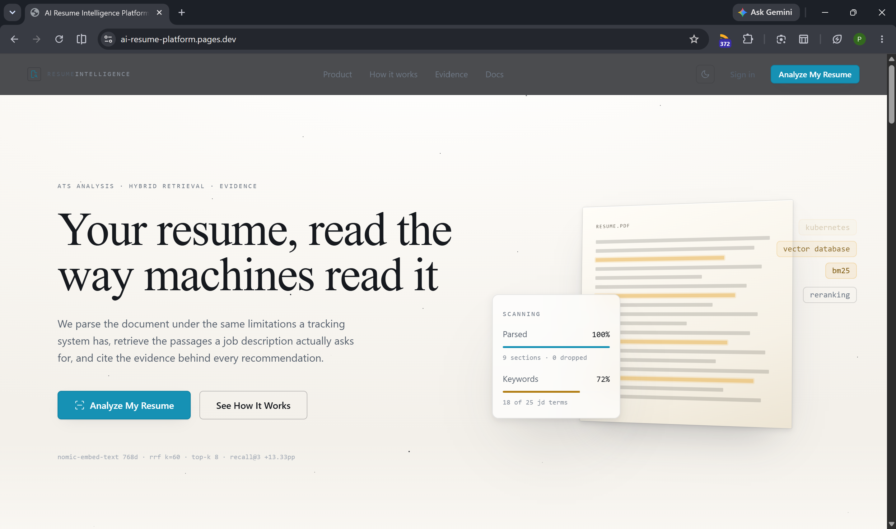
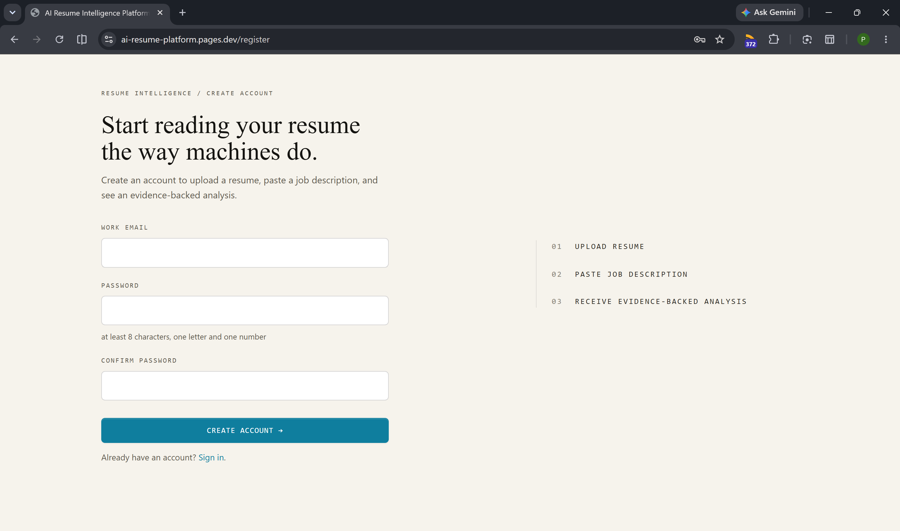
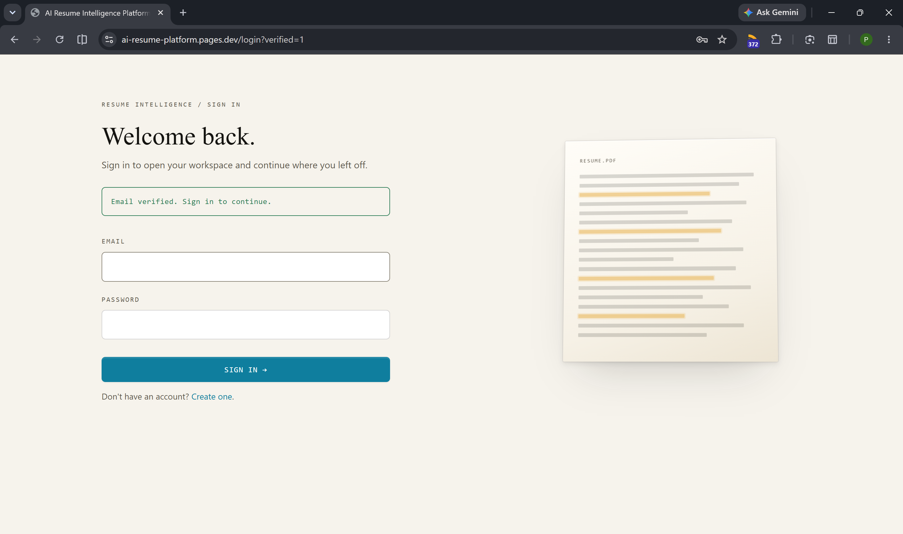
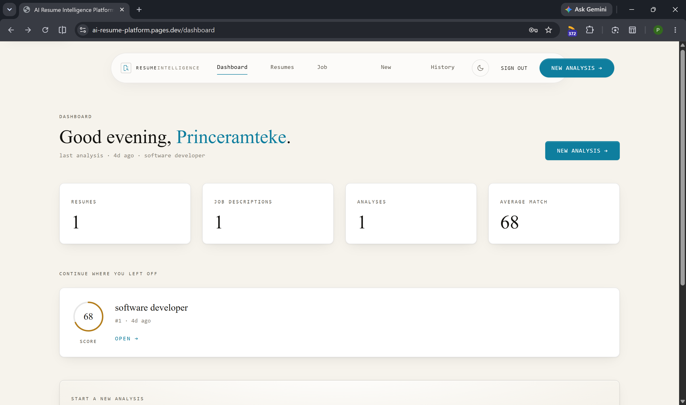
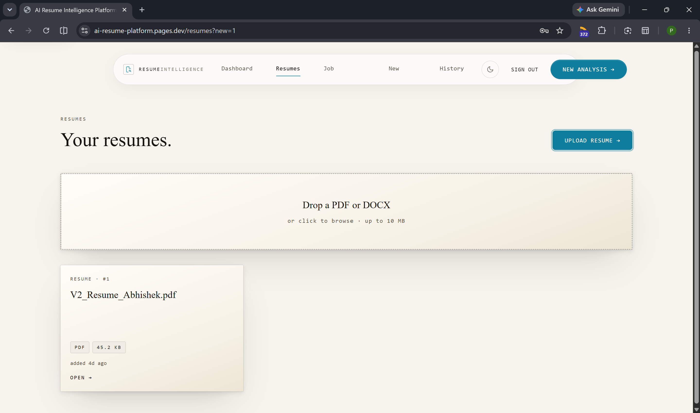
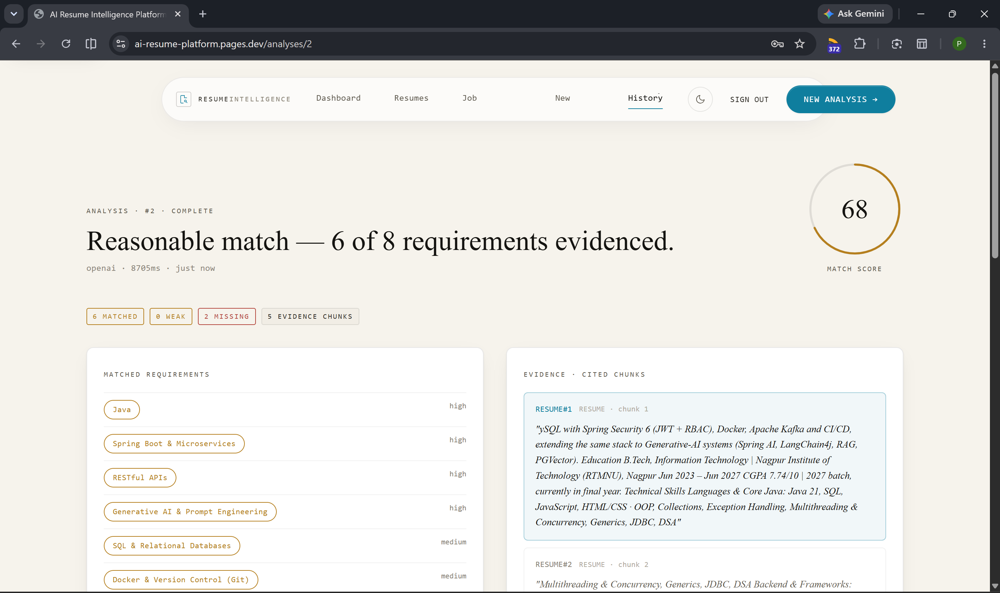
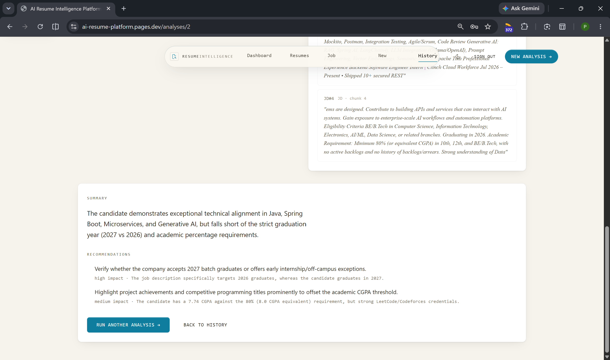

---

## 4. Architecture

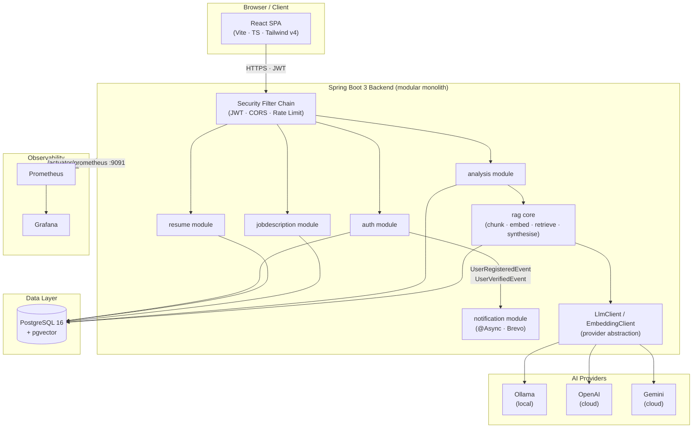

The codebase is **package-by-feature** inside a single deployable JAR. Each feature module owns its full vertical slice — controllers, services, repositories, DTOs, and exceptions. No cross-package imports except through well-defined service interfaces — clean enough to extract as microservices later without rewriting.

---

## 5. End-to-End System Flow

```mermaid
flowchart LR
    A([User]) -->|POST /api/auth/register| B[Register + OTP]
    B -->|Brevo email| C[Verify OTP]
    C -->|POST /api/auth/login| D[JWT issued]
    D -->|POST /api/resumes multipart| E[Upload Resume]
    E -->|Apache Tika| F[Text Extracted]
    F -->|POST /api/job-descriptions| G[JD Stored]
    G -->|POST /api/analyses| H[Analysis Triggered]

    subgraph RAG Pipeline
        H --> I[Load Resume + JD text]
        I --> J[Chunk into 500-char segments]
        J --> K[EmbeddingClient.embed]
        K --> L[Upsert into document_chunks<br/>pgvector HNSW]
        L --> M[Vector search top-k<br/>+ FTS keyword arm]
        M --> N[RRF fusion]
        N --> O[Prompt assembly<br/>with token budget]
        O --> P[LlmClient.complete]
        P --> Q[JSON validation<br/>+ evidence grounding]
        Q --> R[Persist Analysis]
    end

    R -->|201 AnalysisResponse| A
```

---

## 6. AI / RAG Pipeline

The pipeline in [`rag/`](backend/src/main/java/com/princeramteke/resumeai/rag/) runs seven deterministic steps on every analysis request:

- **Parse** — Apache Tika extracts plain text from PDF/DOCX; file type validated by content-type header and magic bytes, not just extension
- **Chunk** — `TextChunker` splits raw text into 500-char overlapping segments (50-char overlap); chunk metadata attached for grounding
- **Embed** — `EmbeddingClient.embed()` produces a float[] per chunk; thin `RestClient` adapters for Ollama (768d), OpenAI (1536d), and Gemini (1536d); embeddings cached per document
- **Hybrid retrieval** — vector cosine ANN (pgvector HNSW) + PostgreSQL full-text search arms run in parallel; `KeywordQueryBuilder` extracts ≤5 technical tokens from the JD before querying; both ranked lists fused by **Reciprocal Rank Fusion** (no ML re-ranker required)
- **Synthesise + ground** — `LlmClient.complete(prompt)` returns a fixed JSON schema; `OutputValidator` drops any claim whose `evidenceRef` does not resolve to a real retrieved chunk; one repair retry issued on malformed JSON; temperature `0.0`, seed `42` for reproducible scores

**Evaluation (15-case suite, production-aligned JD-sentence queries):**

| Mode | Recall@3 | MRR |
|---|---|---|
| Vector-only | 0.567 | 0.728 |
| **Hybrid (default)** | **0.700** | **0.967** |

Full pipeline detail, hybrid retrieval design, and eval methodology → [docs/SYSTEM_ARCHITECTURE.md](docs/SYSTEM_ARCHITECTURE.md) · [docs/eval/retrieval-report.md](docs/eval/retrieval-report.md)

---

## 7. Authentication & Email Verification

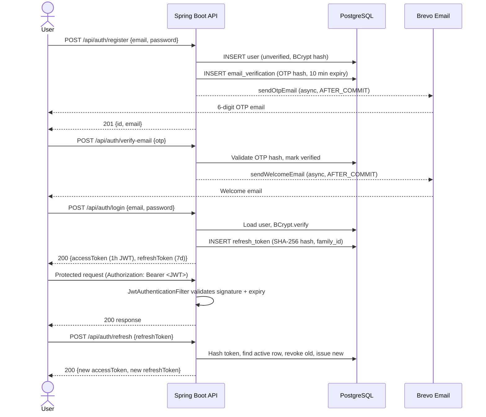

| Concern | Implementation |
|---|---|
| **Password hashing** | BCrypt strength 10; plaintext never stored, logged, or returned |
| **Access token** | HS256 JWT, 1-hour TTL, claims: `sub`, `email`, `role`, `iat`, `exp` |
| **Refresh token** | Cryptographically random 32-byte token; SHA-256 hash persisted; plaintext returned once |
| **Token rotation** | Old refresh token revoked on use; same `family_id` for reuse-attack detection |
| **OTP delivery** | 6-digit code, 10 min expiry, 5 max attempts, 60 s resend cooldown |
| **Async email** | `@TransactionalEventListener(AFTER_COMMIT)` + `@Async` — email fires after commit; HTTP response does not wait |
| **Brevo** | Transactional email via Brevo REST API (`BrevoEmailClient`, thin `RestClient` adapter) |
| **RBAC** | `USER` (default), `ADMIN` — method-level `@PreAuthorize`, ownership checks in service layer |
| **Anti-enumeration** | Non-owner resource requests return `404`, not `403` |

> Google OAuth is **not implemented** — `GOOGLE_OAUTH_ENABLED` exists as a feature flag and the DB scaffolding is in place, but the flow is intentionally excluded from v1.

---

## 8. Tech Stack

| Layer | Technology | Version | Why |
|---|---|---|---|
| **Language** | Java | 21 (LTS) | Records, pattern matching, virtual threads for I/O-bound LLM calls |
| **Backend framework** | Spring Boot | 3.4.1 | Industry standard; auto-config, actuator, rich testing support |
| **ORM** | Spring Data JPA + Hibernate | 6.x | Repository abstraction; native queries for vector search |
| **Security** | Spring Security | 6.x | Mature stateless JWT + method-level RBAC |
| **AI abstraction** | Custom `LlmClient` / `EmbeddingClient` | — | Provider-agnostic; swap model via config, not code |
| **LLM (local)** | Ollama — `llama3.1:8b` | latest | Zero cost, data stays local, fully offline |
| **LLM (cloud)** | OpenAI — `gpt-4o-mini` | — | Quality fallback for demo/production |
| **Embeddings (local)** | Ollama — `nomic-embed-text` (768d) | — | Free, local |
| **Embeddings (cloud)** | OpenAI — `text-embedding-3-small` (1536d) | — | Production quality |
| **Document parsing** | Apache Tika | 2.9.2 | Robust PDF/DOCX extraction with magic-byte validation |
| **Database** | PostgreSQL | 16 | Relational + JSONB verdict fields |
| **Vector search** | pgvector (HNSW) | ≥ 0.5 | ANN similarity search inside Postgres — zero extra infra |
| **Migrations** | Flyway | — | Versioned, repeatable; never edit applied migrations |
| **Rate limiting** | Bucket4j | 8.10.1 | In-memory per-user token bucket |
| **Observability** | Micrometer + Prometheus + Grafana | — | Analysis/LLM latency, token usage, retrieval arm metrics |
| **API docs** | springdoc-openapi (Swagger) | 2.7.0 | Live, always-accurate Swagger UI |
| **Email** | Brevo REST API | — | Transactional email (OTP, welcome, admin notification) |
| **Frontend framework** | React + TypeScript | 19 / 5.7 | Typed, component-driven SPA |
| **Styling** | Tailwind CSS | v4 | Utility-first, small bundle, no component-library lock-in |
| **API client** | TanStack Query + Axios | 5.x / 1.7 | Server state management, caching, typed requests |
| **Frontend testing** | Vitest + React Testing Library | 4.x / 16.x | Component and API-layer tests |
| **Backend testing** | JUnit 5 + Mockito + Testcontainers | — | Unit + integration with real Postgres/pgvector |
| **Coverage** | JaCoCo | 0.8.12 | Coverage gate in the Maven build |
| **CI** | GitHub Actions | — | Backend (`mvnw verify`) + frontend (build, test, lint) on every PR |
| **Frontend hosting** | Cloudflare Pages | — | Global CDN, instant deploys |
| **Backend hosting** | Render | — | PaaS Web Service with managed environment variables |

---

## 9. Backend Architecture

The backend is a **package-by-feature modular monolith**. Each module owns its full vertical slice — no anemic domain model, no shared service spaghetti.

```
com.princeramteke.resumeai/
├── auth/           JWT auth, OTP email verification, refresh tokens, RBAC
├── resume/         Upload, Tika extraction, file validation, storage, soft-delete
├── jobdescription/ Paste or upload JDs, CRUD, text search, soft-delete
├── analysis/       Orchestrates analysis: ownership check → RAG → persist → return
│   └── synthesis/  LLM verdict parsing, schema validation, evidence grounding
├── rag/            The core intelligence pipeline
│   ├── chunking/   TextChunker — fixed-size sliding window
│   ├── embedding/  EmbeddingClient interface + Ollama/OpenAI/Gemini adapters
│   ├── ingestion/  IngestionService — embed + upsert document_chunks
│   ├── retrieval/  RetrievalService — vector arm + keyword arm + RRF fusion
│   └── prompt/     PromptAssembler — token-budgeted prompt construction
├── llm/            LlmClient interface + OllamaLlmClient / OpenAiLlmClient
├── notification/   Brevo email client, event listeners (async), email templates
├── security/       JwtAuthenticationFilter, rate-limit filter, JWT provider
├── config/         Security chain, CORS, async config, OpenAPI, feature flags
└── common/         Global exception handler, error envelope DTO
```

---

## 10. Database Design

Seven tables: `users`, `resumes`, `job_descriptions`, `document_chunks` (vectors), `analyses`, `refresh_tokens`, `email_verifications`. Analyses store skill verdict fields as `JSONB` for schema flexibility. Document chunks use a polymorphic `(source_type, source_id)` reference to avoid a hard FK split. See [docs/DATABASE.md](docs/DATABASE.md) for full DDL, Flyway migration history, and indexing rationale.

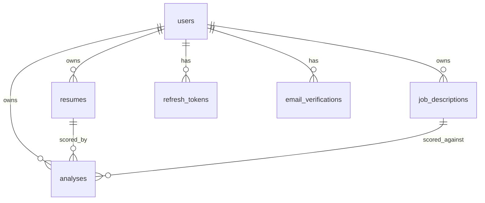

---

## 11. API Reference

Full interactive documentation: **[Swagger UI (production)](https://ai-resume-platform-backend-rmgn.onrender.com/swagger-ui/index.html)** · locally at `http://localhost:8080/swagger-ui/index.html`

| Method | Path | Auth | Description |
|---|---|---|---|
| `POST` | `/api/auth/register` | Public | Register; triggers OTP email via Brevo |
| `POST` | `/api/auth/verify-email` | Public | Submit OTP to verify email |
| `POST` | `/api/auth/login` | Public | Login; returns access + refresh tokens |
| `POST` | `/api/auth/refresh` | Public | Rotate refresh token |
| `POST` | `/api/resumes` | JWT | Upload resume (PDF/DOCX, ≤ 10 MB) |
| `POST` | `/api/analyses` | JWT | Run RAG analysis (rate-limited: 5/15 min) |
| `GET` | `/api/analyses/{id}` | JWT | Full result: score, skills, evidence thread |
| `GET` | `/actuator/health` | Public | Liveness / readiness |

Full endpoint inventory (25 endpoints), request/response shapes, and error envelope → [docs/API.md](docs/API.md)

---

## 12. Project Structure

```
AI-Resume-Platform/
├── backend/
│   ├── Dockerfile                      # Multi-stage: Maven build → JRE runtime
│   ├── pom.xml
│   └── src/
│       ├── main/java/com/princeramteke/resumeai/
│       │   ├── auth/ resume/ jobdescription/ analysis/
│       │   ├── rag/  llm/   notification/   security/
│       │   └── config/  common/
│       ├── main/resources/
│       │   ├── application.yml  application-docker.yml
│       │   └── db/migration/    # V1–V8 Flyway SQL migrations
│       └── test/java/           # 31 unit + 3 integration test classes
├── frontend/
│   ├── Dockerfile                      # Node build → nginx:alpine
│   └── src/
│       ├── app/pages/          # auth, dashboard, resume, JD, analysis
│       ├── app/primitives/     # Button, Card, Badge, ScoreDial, …
│       └── app/pipeline/       # PipelineTrack, ScanBeam, EvidenceLink
├── docs/
│   ├── API.md  DATABASE.md  DEPLOYMENT.md  ROADMAP.md
│   ├── SECURITY.md  SYSTEM_ARCHITECTURE.md  TECH_STACK.md  TESTING.md
│   └── eval/retrieval-report.md
├── monitoring/
│   ├── prometheus.yml
│   └── grafana/provisioning/  grafana/dashboards/resume-ai.json
├── .github/workflows/ci.yml
├── docker-compose.yml
├── .env.example
└── .gitignore
```

---

## 13. Local Development

### Prerequisites

- Docker Desktop (for Docker Compose and Testcontainers)
- Java 21 · Node 20 (for running backend/frontend outside Docker)

### One-command stack (recommended)

```bash
git clone https://github.com/prince-ramteke/AI-Resume-Platform.git
cd AI-Resume-Platform
cp .env.example .env
# Edit .env: set JWT_SECRET to a random 256-bit value
docker-compose up --build
```

> **First boot:** Ollama pulls `llama3.1:8b` (~4.7 GB) and `nomic-embed-text`. Subsequent starts are instant.

| Service | URL |
|---|---|
| Frontend | http://localhost:5173 |
| API | http://localhost:8080 |
| Swagger UI | http://localhost:8080/swagger-ui/index.html |
| Prometheus | http://localhost:9090 |
| Grafana | http://localhost:3000 (admin / `GRAFANA_ADMIN_PASSWORD`) |

### Running Tests

```bash
# Backend: unit + integration (Testcontainers needs Docker)
cd backend && ./mvnw verify

# Frontend
cd frontend && npm run test && npm run lint
```

---

## 14. Environment Variables

Copy [`.env.example`](.env.example) to `.env`. Never commit `.env`.

| Variable | Required | Description |
|---|---|---|
| `DB_URL` | Yes | JDBC connection URL |
| `JWT_SECRET` | Yes | ≥256-bit random secret — `openssl rand -hex 32` |
| `LLM_PROVIDER` | No | `ollama` (default) or `openai` |
| `OLLAMA_BASE_URL` | No | Ollama endpoint (default: `http://ollama:11434`) |
| `BREVO_API_KEY` | Conditional | Required when `NOTIFICATION_ENABLED=true` |
| `BREVO_SENDER_EMAIL` | Conditional | Verified sender address in Brevo |
| `FRONTEND_ORIGIN` | No | CORS allowed origin (default: `http://localhost:5173`) |
| `STORAGE_PATH` | No | Local file storage directory (default: `./uploads`) |

See [`.env.example`](.env.example) and [docs/DEPLOYMENT.md](docs/DEPLOYMENT.md) for the complete configuration reference (30 variables including RAG tuning, embedding dimensions, OTP settings, and feature flags).

---

## 15. Testing

**Critical pattern — AI determinism:** `FakeLlmClient` returns canned JSON; `FakeEmbeddingClient` returns deterministic hash-seeded vectors. No Ollama, no OpenAI, no network in any test. The entire suite runs in CI on a cold machine with Testcontainers providing a real pgvector database.

| Category | Count |
|---|---|
| Backend unit test classes | 31 |
| Backend integration test classes (Testcontainers) | 3 |
| Frontend test files (Vitest + RTL) | 6 |

JaCoCo coverage gate enforced in `mvnw verify`: ≥ 80% service layer · ≥ 85% RAG core · ≥ 75% overall.

Full test strategy, per-layer coverage rationale, and test data guidelines → [docs/TESTING.md](docs/TESTING.md)

---

## 16. CI/CD & Deployment

### CI Pipeline (GitHub Actions)

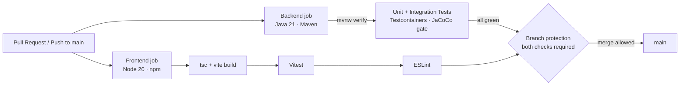

Both the `backend` and `frontend` jobs must pass before a PR can merge into `main`.

### Production vs Local

| Concern | Local (Docker Compose) | Production (Render + Cloudflare) |
|---|---|---|
| **LLM** | Ollama `llama3.1:8b` | OpenAI `gpt-4o-mini` |
| **Embeddings** | Ollama `nomic-embed-text` (768d) | OpenAI `text-embedding-3-small` (1536d) |
| **Vector dimension** | 768 (V1–V6 schema) | 1536 (V7 migration widens column) |
| **Email** | Disabled (`NOTIFICATION_ENABLED=false`) | Enabled (`NOTIFICATION_ENABLED=true`, Brevo) |
| **Observability** | Prometheus + Grafana in Compose | `/actuator/health` only |
| **Frontend** | Nginx container :5173 | Cloudflare Pages CDN |

Production: Cloudflare Pages (React SPA) → Render Web Service (Spring Boot JAR) → Render PostgreSQL 16 with pgvector · OpenAI API · Brevo. Flyway runs V1–V8 automatically on first startup.

```bash
# Smoke test
curl https://ai-resume-platform-backend-rmgn.onrender.com/actuator/health
```

---

## 17. Security

- **BCrypt + JWT** — passwords hashed at strength 10; stateless HS256 access tokens (1 h); refresh tokens SHA-256 hashed before storage, rotated on every use
- **RBAC + ownership** — `@PreAuthorize` for role checks; every service method loads resources by `(id, userId)` and returns `404` on mismatch — enumeration-safe
- **Prompt injection** — uploaded text is labeled as untrusted data in the prompt; system instructions are isolated; output validated against a fixed schema before returning
- **Upload safety** — content-type header and magic-byte validation before Tika parsing; 10 MB size limit enforced before reading file bytes
- **Rate limiting** — Bucket4j per-user token bucket on `POST /api/analyses` (5/15 min); `Retry-After` on 429
- **Metrics isolation** — Prometheus endpoint on management port `9091`, deliberately not published in `docker-compose.yml`; never internet-exposed

Full threat model and filter-chain configuration → [docs/SECURITY.md](docs/SECURITY.md)

---

## 18. Engineering Decisions

### Spring Boot — not a microservices framework

The codebase is a modular monolith. Splitting into microservices for a single-developer v1 adds network overhead, distributed tracing complexity, and operational burden with no real benefit. Package-by-feature keeps clean module boundaries — the same discipline that makes future extraction straightforward. *When to split: if the analysis/RAG module becomes CPU-heavy enough to need independent scaling.*

### PostgreSQL + pgvector — not a dedicated vector database

One datastore means transactional consistency between relational data and vectors, zero extra infrastructure, and simpler deployment. pgvector's HNSW index delivers the latency profile needed at this scale. *When to revisit: at millions of document chunks where pgvector query performance degrades under concurrent load.*

### Custom `LlmClient` / `EmbeddingClient` interfaces

The single strongest design decision: the rest of the application is completely provider-agnostic. Swapping from Ollama to OpenAI to Gemini is a config change (`LLM_PROVIDER=openai`), not a code change. Feature modules never import Ollama or OpenAI types. This makes the system demonstrably future-proof.

### Ollama (local) primary, OpenAI fallback

Zero cost during development. Document text never leaves the machine. Demos stay within a free tier. The OpenAI fallback exists for production quality when that matters. Provider fallback is available via `LLM_FALLBACK_ENABLED=true`: if the primary provider times out or errors, the request retries via the configured fallback client.

### Brevo for transactional email

Brevo's REST API is simple (a single `POST` with `to`, `subject`, `htmlContent`), has a generous free tier, and does not require SMTP credentials. The `BrevoEmailClient` is a thin `RestClient` adapter — swapping providers means changing one class behind the `EmailService` interface.

### Flyway — not `ddl-auto: update`

Hibernate DDL auto-update is unpredictable in production. Flyway gives versioned, reviewable, repeatable migrations. The schema is the source of truth; entities use `ddl-auto: validate` to confirm they match. *Rule: never edit an applied migration; add a new one.*

### Async event-driven email delivery

`@TransactionalEventListener(AFTER_COMMIT)` + `@Async` means:
1. Email fires only after the DB transaction successfully commits — no emails for rolled-back registrations.
2. The HTTP registration response does not wait for SMTP delivery — the user gets an instant `201`.
3. Email failures are logged as warnings but do not propagate to the HTTP layer.

### JWT — stateless auth

No server-side session store. Every request is authenticated by the token signature alone. Scales horizontally without sticky sessions. Access token TTL is 1 hour; refresh tokens (7-day, SHA-256 hashed, rotated on use) balance security with UX.

---

## 19. Roadmap

These are realistic near-term additions — all infrastructure exists, none are implied to already be shipped.

| Item | Notes |
|---|---|
| **Redis-backed rate limiting** | Replace in-memory Bucket4j with Redis for multi-instance deployments |
| **SSE streaming results** | Stream the analysis verdict token-by-token for perceived speed on slow models |
| **PDF report export** | Download analysis result as a formatted PDF |
| **Recruiter batch mode** | Submit one JD against N resumes; ranked leaderboard output |
| **Inline resume suggestions** | Rewrite specific resume bullets to better match a JD requirement |
| **Kubernetes deployment** | Helm chart for the backend and managed Postgres when the platform scales |
| **Model fine-tuning eval** | Measure whether fine-tuned smaller models match `gpt-4o-mini` quality at lower cost |

---

## 20. Author

**Prince Ramteke**
Software Engineer — Java / Spring Boot / AI Systems

- GitHub: [@prince-ramteke](https://github.com/prince-ramteke)

---

<p align="center">
Built with Java 21 · Spring Boot 3 · PostgreSQL + pgvector · Ollama · React 19
</p>
